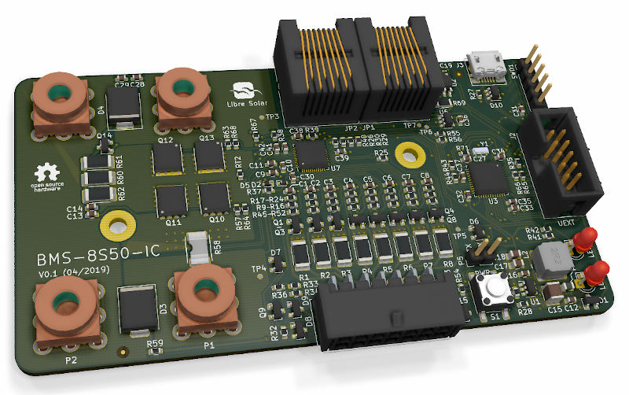

# BMS 8S50 IC

 First boards tested, some issues might still be open.

Schematic: [PDF file](https://github.com/LibreSolar/bms-8s50-ic/raw/master/build/bms-8s50-ic_schematic.pdf)

Bill of Materials: [CSV file](build/bms-8s50-ic_bom.csv) or [interactive HTML BOM](https://libre.solar/bms-8s50-ic/build/bms-8s50-ic_ibom.html)

Firmware repository: [LibreSolar/bms-firmware](https://github.com/LibreSolar/bms-firmware)

## Features:

- 3 to 8 Li-ion cells (e.g. LiFePO4)
- Integrated high-side MOSFET switch and current sensor
- Balancing current approx. 150 mA
- STM32L452 ARM Cortex-M4 microcontroller
- Built-in CAN communication interface and UEXT extension connector

## Firmware

The firmware is developed in a separate repository [LibreSolar/bms-firmware](https://github.com/LibreSolar/bms-firmware).

## Housing

The PCB is designed such that a heat sink can be easily attached at the bottom. The following images show a draft idea for the housing. The files of the heat sink and the cover can be found in the `housing` folder as native FreeCAD files.

## Important Notice

The PCBs have not been tested regarding EMC and other regulations. If you reproduce the boards, you use them at your own risk and responsibility.
